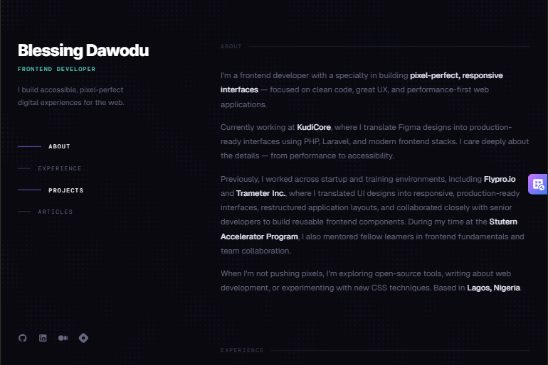

# React + Vite: Dev with AI the smart way

Blessing Dawodu — Frontend Developer Portfolio
A single-page portfolio built with React + Vite, styled with plain CSS, animated with Framer Motion, and featuring the FallingPattern background component from 21st.devs.

*Inspired by Brittany Chiang's layout: dark-themed, two-column sticky sidebar with scroll-spied vertical navigation.*

# Blessing Dawodu — Frontend Developer Portfolio

A single-page portfolio built with **React + Vite**, styled with **plain CSS**, animated with **Framer Motion**, and featuring the **FallingPattern** background component from [21st.dev](https://21st.dev).

> Inspired by Brittany Chiang's layout: dark-themed, two-column sticky sidebar with scroll-spied vertical navigation.

---

## Live Preview

[blessing-dawodu-portfolio.netlify.app](https://blessing-dawodu-portfolio.netlify.app/)


---

## Tech Stack

| Tool | Purpose |
|---|---|
| React 18 | UI framework |
| Vite 5 | Build tool & dev server |
| Framer Motion 11 | Animations (entrance, scroll, hover) |
| Plain CSS | Styling — no Tailwind, no CSS-in-JS |
| 21st.dev FallingPattern | Animated background component |
| Google Fonts | Inter · DM Mono · Geist |

---

## File Structure

```
my-portfolio/
├── index.html                    ← HTML entry — has Google Fonts <link>
├── package.json
├── vite.config.js
└── src/
    ├── main.jsx                  ← React root
    ├── App.jsx                   ← All sections + Framer Motion logic
    ├── App.css                   ← All styles + media queries
    ├── data.js                   ← All data
    └── FallingPattern.jsx    ← 21st.dev component (adapted, no Tailwind)
```

---

## Step-by-Step Setup (React + Vite)

### Step 1 — Scaffold a new Vite project

Open your terminal and run:

```bash
npm create vite@latest my-portfolio -- --template react
cd my-portfolio
```

This creates a fresh React + Vite project. The `--template react` flag gives you JSX support out of the box.

---

### Step 2 — Install dependencies

```bash
npm install
npm install framer-motion
```

That's the only extra package you need. Framer Motion powers all entrance animations, scroll-triggered reveals, and hover effects.

---

### Step 3 — Run the dev server

```bash
npm run dev
```

Open [http://localhost:5173](http://localhost:5173) in your browser. You should see the dark portfolio with the falling pattern background.

---

### Step 4 — Personalise the content

Most content lives in **`src/App.jsx`** in the data file are plain JavaScript arrays. No CMS, no config files — just edit these:

```js
// Your nav links
const NAV_LINKS = [ ... ]

// Your work history
const EXPERIENCE = [ ... ]

// Your projects
const PROJECTS = [ ... ]

// Your articles / blog posts
const ARTICLES = [ ... ]
```

Also update:

- **Hero section** — change `Blessing`, `Dawodu`, and the tagline text (search for `hero-name`, `hero-role`, `hero-tagline` in `App.jsx`)
- **About section** — update the four `<p>` paragraphs inside the `id="about"` section
- **Social links** — replace the `href="#"` values with your real GitHub, LinkedIn, and portfolio URLs
- **Footer** — update the name and link

---

### Step 5 — Customise the FallingPattern colours

The `FallingPattern` component accepts props. In `App.jsx`, find:

```jsx
<FallingPattern
  color="rgba(124,106,247,0.28)"   ← purple-ish lines
  backgroundColor="#09090f"        ← near-black bg
  duration={120}                   ← seconds per loop
  blurIntensity="1.5em"            ← overlay blur
  density={1.1}                    ← dot grid density
/>
```

Try changing `color` to match your brand. Example teal version:

```jsx
<FallingPattern
  color="rgba(94,234,212,0.22)"
  backgroundColor="#040d0c"
  duration={100}
/>
```

---

### Step 6 — Customise colours

All colour tokens are CSS variables at the top of `App.css`:

```css
:root {
  --bg:      #09090f;   /* page background */
  --surface: #13131f;   /* card background */
  --border:  #1e1e2e;   /* subtle borders */
  --accent:  #7c6af7;   /* purple — tags, active nav */
  --accent2: #5eead4;   /* teal — company names, links */
  --text:    #e2e2f0;   /* primary text */
  --muted:   #666680;   /* body text */
  --muted2:  #444458;   /* timestamps, labels */
}
```

Change `--accent` and `--accent2` to match your personal brand colour.

---

### Step 7 — Build for production

```bash
npm run build
```

This outputs a `dist/` folder with optimised, minified files ready to deploy.

---

## Deployment

### Netlify (recommended — free)

1. Push your project to GitHub
2. Go to [netlify.com](https://netlify.com) → **Add new site → Import from Git**
3. Select your repo
4. Set build command: `npm run build`
5. Set publish directory: `dist`
6. Click **Deploy site**

Netlify auto-deploys on every `git push`.

### Vercel (alternative — also free)

```bash
npm install -g vercel
vercel
```

Follow the prompts — Vercel auto-detects Vite.

---

## How the Animations Work

### Hero entrance (left panel)
The name, role, and tagline animate in on mount using Framer Motion's `initial` / `animate` props with staggered delays:

```jsx
<motion.h1
  initial={{ opacity: 0, y: 32 }}
  animate={{ opacity: 1, y: 0 }}
  transition={{ duration: 0.7, delay: 0.1 }}
>
```

### Nav links (vertical, staggered)
Each nav link slides in from the left with an increasing delay:

```jsx
<motion.a
  initial={{ opacity: 0, x: -16 }}
  animate={{ opacity: 1, x: 0 }}
  transition={{ delay: 0.45 + index * 0.08 }}
>
```

The active link indicator (the expanding line) is pure CSS using `transition: width` on `.nav-line`.

### Experience & Project cards (scroll-triggered)
Each item uses `useInView` from Framer Motion to fire the animation only when the element enters the viewport:

```jsx
const ref = useRef(null);
const inView = useInView(ref, { once: true, margin: '-10% 0px -20% 0px' });

<motion.div
  ref={ref}
  variants={fadeUp}
  initial="hidden"
  animate={inView ? 'visible' : 'hidden'}
>
```

`once: true` means the animation only plays once — it doesn't reset when you scroll back up.

### Tags (scale pop)
Tags inside each experience item animate with a `scale` entrance staggered after the card:

```jsx
const tagPop = {
  hidden: { opacity: 0, scale: 0.85 },
  visible: (i) => ({
    opacity: 1, scale: 1,
    transition: { delay: 0.15 + i * 0.05, ease: 'backOut' }
  }),
};
```

---

## Active Nav Scrollspy

The active nav state updates automatically as you scroll using the native `IntersectionObserver` API:

```js
useEffect(() => {
  const observer = new IntersectionObserver(
    (entries) => {
      entries.forEach((entry) => {
        if (entry.isIntersecting) setActiveSection(entry.target.id);
      });
    },
    { threshold: 0.3, rootMargin: '-20% 0px -60% 0px' }
  );
  document.querySelectorAll('section[id]').forEach((s) => observer.observe(s));
  return () => observer.disconnect();
}, []);
```

`rootMargin: '-20% 0px -60% 0px'` means a section is considered "active" when it occupies the middle band of the viewport — avoiding false triggers when two sections are partially visible.

---

## Responsive Breakpoints

| Breakpoint | Layout |
|---|---|
| > 900px | Two-column: 320px sticky sidebar + scrollable main |
| 768px–900px | Two-column: 260px sidebar + main |
| ≤ 768px | Single column, sidebar stacks above content |
| ≤ 480px | Small mobile tweaks, articles stack vertically |

The `FallingPattern` background is hidden on mobile (`display: none`) to save battery and avoid performance issues on low-end devices.

---

## Credits

- Layout inspired by [Brittany Chiang's portfolio](https://brittanychiang.com)
- FallingPattern component from [21st.dev](https://21st.dev)
- Fonts: [Inter](https://fonts.google.com/specimen/Inter), [DM Mono](https://fonts.google.com/specimen/DM+Mono), [Geist](https://fonts.google.com/specimen/Geist) via Google Fonts

---

